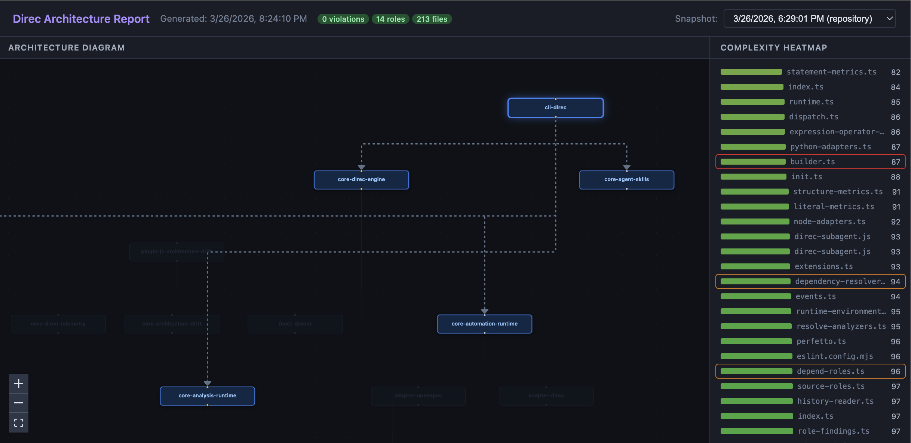

<p align="center">
  
</p>

<h3 align="center">Boundary-first agentic development</h3>

<p align="center">
  <a href="https://www.npmjs.com/package/direc"></a>
  <a href="https://github.com/spectotal/direc/blob/main/LICENSE"></a>
</p>

---

Direc is a CLI for turning a repository into a living architecture workspace.

Instead of keeping architecture in static docs that drift out of date, Direc lets you define architectural bounds, read the current codebase, run analyzers, store snapshots under `.direc/`, and generate reports you can use while the code is still changing.

The goal is boundary-first agentic development: humans define the architecture, then agents can work inside those bounds while following a spec-driven development workflow. Direc is built to support that model across agent setups, and the workflow integration available today is OpenSpec.

<p align="center">
  
</p>

<p align="center">
  <em>Example output from <code>direc viz</code>.</em>
</p>

## What Direc Actually Does

- `direc init` creates a repo-local `.direc/config.json` from the repository's detected facets.
- `direc analyze` runs the matching analyzers and writes the latest snapshots plus history under `.direc/`.
- `direc viz` turns those snapshots into a shareable HTML report with an architecture diagram and complexity heatmap.
- `direc init --agent ...` can scaffold repo-local commands and skills for Codex, Claude Code, and Antigravity.
- It is designed for agents working from spec-driven workflows, with OpenSpec integration available today.

Shortest version: Direc is repository architecture analysis, visualization, and agent scaffolding around one shared boundary model, so agents can respect the bounds you define.

## Quick Start

Requires Node.js `>=18.18`.

```bash
npx direc init --agent codex
npx direc analyze
npx direc viz --open
```

That flow:

1. Detects the repository shape and writes `.direc/config.json`
2. Saves analyzer snapshots in `.direc/latest/` and `.direc/history/`
3. Generates `direc-viz.html` by default

If you prefer a global install:

```bash
npm install -g direc
```

If you omit `--agent` in an interactive terminal, Direc prompts you to choose which agent files to scaffold.

## The Workspace Direc Creates

- `.direc/config.json` contains detected facets, analyzer settings, exclusions, thresholds, and architecture boundaries.
- `.direc/latest/` stores the latest snapshot for each analyzer.
- `.direc/history/` stores historical snapshots across repository or change-scoped runs.
- Repo-local agent assets are generated only if you ask for them, for example under `.codex/` or `.claude/`.

After scaffolding an agent, the usual next step is to run `/direc-bound` in that agent so it can refine architecture roles and rules against the current repository.

## Core Commands

```bash
direc init --agent codex --agent claude
direc analyze
direc analyze --watch
direc doctor
direc viz --open
```

- `init` bootstraps the Direc workspace and resolves analyzers from detected facets.
- `analyze` runs enabled analyzers such as architecture drift and complexity.
- `doctor` checks that config, analyzers, and extensions can load correctly.
- `viz` renders the current `.direc` state into HTML.

### Load extensions

```bash
direc init --extension @acme/direc-python
direc analyze --extension ./my-plugin.mjs
```

## How Analyzer Selection Works

Direc uses **facets** to infer what kind of repository it is analyzing.

1. It scans for signals such as `package.json`, `tsconfig.json`, source extensions, and other tool markers.
2. It enables analyzers that support the detected facets and pass their prerequisites.
3. You can override the defaults in `.direc/config.json` by enabling, disabling, or reconfiguring analyzers.

This keeps the default setup lightweight. JavaScript and TypeScript repositories can get architecture-drift and complexity analysis immediately, while extensions can add analyzers for other stacks.

## Spec-Driven Workflows

> [!WARNING]
> Experimental. The workflow automation surface is still evolving.

```bash
direc automate
direc automate --workflow openspec
```

`direc automate` watches workflow events, runs analyzers first, and writes automation requests and results under `.direc/automation/`.

Direc is meant to fit agent workflows that are driven by specs or change artifacts. The currently integrated workflow is OpenSpec.

## License

[MIT](LICENSE)
